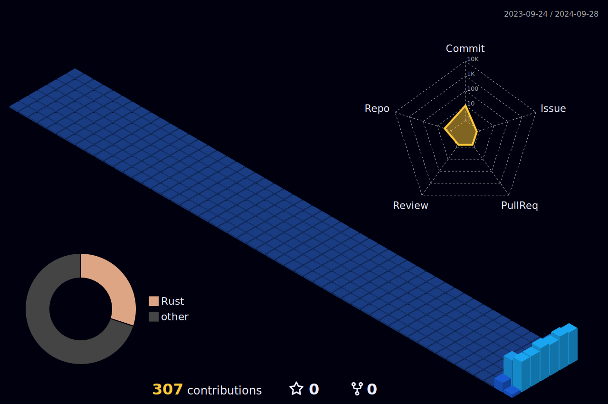

# Altrix

  
  
  
  

***Altri x***

***Altruism × ⚪︎⚪︎***

I'm a software engineer from Japan.
Guided by altruism, I engage in technology, business, and creative activities.

## Skill

  

## Log

## Status

    
    

## Repo

  
  

